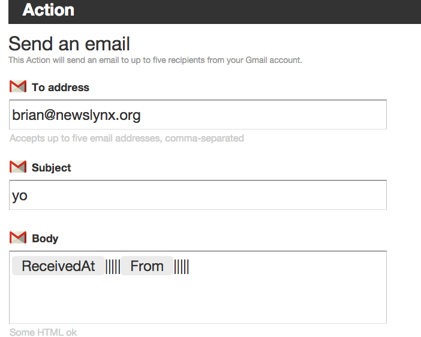

# ifttt (If That Then This)
`ifttt` is a simple package for connecting [IFTTT](http://ifttt.com) 
channels with your service via email.

## what?

[IFTTT](http://ifttt.com) provides an interface to an amazing number of services, but since they
lack their own API and have a closed submission process, it's difficult to integrate it into
your own applications.  

By creating a set of transformations for routing IFTTT channels to email,
we can pass structured data to custom email-listener functions – `ifthat`
which can be routed to an arbitrary `thenthis` callback function.

## Installation

requires `gevent` and `pytz`

```
pip install ifttt
```

## Usage

###  If That Then Say Tweet ...


Make an "IfThis" Twitter Recipe that has an "ThenThat" 
mail step (customize the address to match your configuration)


[](https://ifttt.com/recipes/229283-if-twitter-then-data)


Now write a python script to read from this inbox, filtered by the subject,
copy the pattern from the "body" field, and pass the message to a 
custom function that speaks the tweet text.


```python 
from ifttt import ifthat

@ifthat('twitter', pattern = "{{UserName}}|||||{{LinkToTweet}}|||||{{Text}}|||||")
def twitter(msg):
    import os 
    os.system('tweet from {text}'.format(**msg['body']))
    return msg

for msg in twitter():
    print msg
```

### If This Then Say YO


Make an "IfThis" Yo Recipe that has an "ThenThat" 
mail step (customize the address to match your configuration)


[](https://ifttt.com/recipes/229285-if-yo-then-data)

Now write a similar python script as above:

```python
from ifttt import ifthat

@ifthat('yo', pattern="{{ReceivedAt}}|||||{{From}}|||||")
def yo(msg):
    import os
    os.system('say yo from {from} &'.format(**msg['body']))
    return msg 
    
for msg in yo():
    print msg
```

This basic approach works for every channel!

## Schema

### Body PatternFormat

All email bodies (the "pattern") should be format as follows:

```
pattern = "{{IFTTT_INGREDIENT_1}}||||{{IFTTT_INGREDIENT_2}}||||"
```

This pattern ensures that new channels can be configured simply 
by separating all of its ingredients with 5 pipes (`||||`).

### Messsage

All email messages routed to `thenthis` steps 
are processed to have the following 
format (a simple python dictionary):

```python
{
    'id': '548d15ea3c46c_119282d32c497a2@ip-10-180-52-134.mail', 
    'subject': 'yo',
    'from': 'gmail@example.com', 
    'to': 'brian@newslynx.org',  
    'timestamp': 1418553603,     # utc timestamp when message was processed
    'body': {                    # parsed body
        'received_at': 'December 13, 2014 at 11:45PM', 
        'from': 'ABELSONLIVE'
    }
}
```

## Configuration

You can pass more parameters into the decorator:

```python
from ifttt import ifthat

config = dict(
    subject = 'yo', # subject line filter
    pattern="{{ReceivedAt}}|||||{{From}}|||||", # pattern for ifttt input
    username='username@example.com', # imap username (the email to send things to)
    password='123456', # imap password
    server='mail.example.com', # imap server
    port = 993, # imap port
    cache_size = 100, # how many message ids to keep track in the cache (non-persistent),
    num_workers = 5, # how many workers for the processing queue.
    refresh = 120, # how often to refresh the inbox ,
    noise =  0.2 # random noise to add to refresh.
)
@ifthat(**config)
def yo(msg):
    import os
    os.system('say yo from {from} &'.format(**msg['body']))
    return msg 
    
for msg in yo():
    print msg
```

You can also simply inherit from the core class and  overwrite the `thenthis` method:

```python
from ifttt import IfThat

class Yo(IfThat):
    def __init__(self):
        IfThat.__init__(self,
            subject = 'yo', # subject line filter
            pattern="{{ReceivedAt}}|||||{{From}}|||||", # pattern for ifttt input
            username='username@example.com', # imap username (the email to send things to)
            password='123456', # imap password
            server='mail.example.com', # imap server
            port = 993, # imap port
            cache_size = 100, # how many message ids to keep track in the cache (non-persistent),
            num_workers = 5, # how many workers for the processing queue.
            refresh = 120, # how often to refresh the inbox ,
            noise =  0.2 # random noise to add to refresh.
        )

    def thenthis(self, msg):
        import os
        os.system('say yo from {from} &'.format(**msg['body']))
        return msg

yo = Yo()
for msg in yo.listen():
    print msg
```

Alternatively, you can set these environmental variables:

```bash
export IFTTT_USERNAME='username@domain.com'
export IFTTT_PASSWORD='password'
export IFTTT_SERVER='mail.domain.com'
export IFTTT_PORT=993
```

## TODO
- [ ] Delete Messages
- [ ] Support for more complicated email searches.
- [ ] Instead of caching, update last update and filter for messages after that point?
